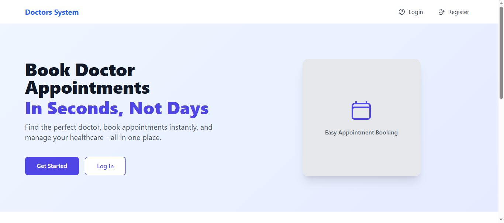
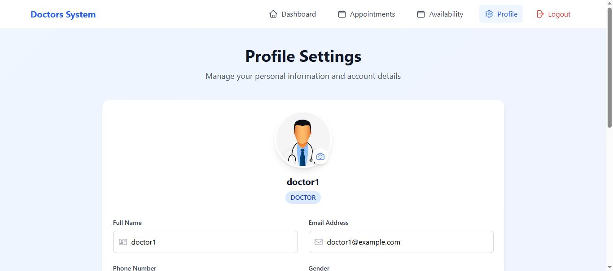
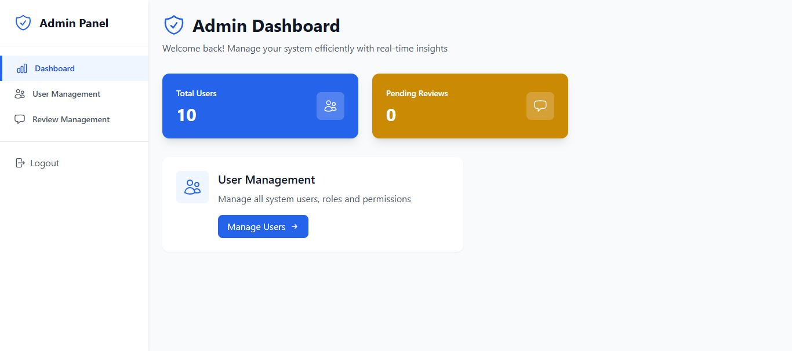
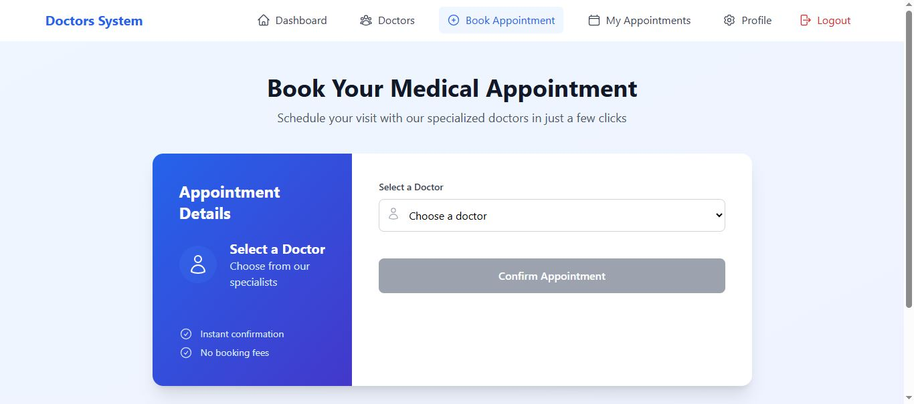

# 🏥 Doctors Appointment System

A full-stack web application that allows patients to book appointments with doctors, and enables doctors and admins to manage the system efficiently.

---

## 🚀 Features

### 👤 Authentication & Roles

* User registration and login (Doctor, Patient, Admin).
* Role-based access control.

### 🧑‍⚕️ Doctor Features

* Set availability for appointments by day and time.
* View, confirm, or cancel appointments.
* View patients and manage profile.

### 🧑‍💼 Admin Features

* Add, edit, or remove doctors and users.
* Approve or reject doctor reviews.
* View system analytics.

### 🧑‍💊 Patient Features

* Browse and search doctors by specialization or city.
* Save favorite doctors.
* Book appointments from available time slots.
* View appointment history.

### 💬 Reviews & Ratings

* Patients can submit reviews for doctors.
* Admin approves/rejects reviews before they appear publicly.

### 📅 Appointment Calendar

* Doctors view their appointments on a calendar.
* Only upcoming (within 30 days) appointments shown by default.

---

## 🖥️ Screenshots







---

## ⚙️ Installation

### 1. Clone the project

```bash
git clone https://github.com/your-username/doctors-appointment-system.git
cd doctors-appointment-system
```

### 2. Setup Backend (Laravel)

```bash
cd doctors-api
composer install
cp .env.example .env
php artisan key:generate
php artisan migrate
php artisan serve
```

### 3. Setup Frontend (React)

```bash
cd ../doctors-frontend
npm install
npm run dev
```

---

## 🛠️ Tech Stack

* **Frontend**: React, TailwindCSS, Axios
* **Backend**: Laravel (PHP), RESTful API
* **Database**: MySQL
* **Authentication**: Sanctum
* **Version Control**: Git & GitHub

---

## 👨‍💻 Author

**Mohamed Sadiik**
Full-Stack Developer passionate about building real-world solutions.

[LinkedIn](https://www.linkedin.com/in/mohamed-sadik-43445825b/) | [GitHub](https://github.com/mosadikdev) | [Portfolio](https://mohameddevportfolio.netlify.app/)

---

## 📄 License

This project is open source and available under the [MIT License](LICENSE).
